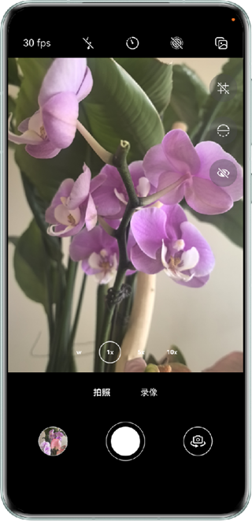

## 实现自定义相机功能

### 介绍

本示例基于Camera Kit相机服务，使用ArkTS API实现基础预览、预览画面调整（前后置镜头切换、闪光灯、对焦、调焦、设置曝光中心点等）、预览进阶功能（网格线、水平仪、超时暂停等）、双路预览（获取预览帧数据）、拍照（动图拍摄、延迟拍摄等）、录像等核心功能。为开发者提供自定义相机开发的完整参考与实践指导。

### 效果预览



使用说明：
1. 打开应用，授权后展示预览界面。
2. 上方从左至右按钮功能依次为：预览帧率设置、闪光灯设置、延迟拍照模式设置、动态拍照模式设置、单双段拍照模式设置（单段拍照模式不支持动态拍摄）。
3. 切换录像模式，上方按钮依次为：预览帧率设置、闪关灯设置、防抖模式设置（模式不支持变焦）。
4. 右侧按钮依次为：网格线、水平仪、双路预览（获取预览帧数据）。
5. 下方按钮可拍照，录像，切换前后置摄像头。

### 工程目录

```
├──camera/                                          // 相机模块
│  ├──src/main/ets/  
│  │  ├──components/                                // 相机组件
│  │  │  ├──GridLine.ets                            // 网格线组件
│  │  │  └──LevelIndicator.ets                      // 水平仪组件
│  │  ├──constants/
│  │  │  └──CameraConstants.ets                   // 相机常量文件
│  │  └──cameramanagers/                          // 相机管理器
│  │     ├──CameraManager.ets                     // 相机会话管理类
│  │     ├──ImageReceiverManager.ets                // ImageReceiver预览流管理类
│  │     ├──OutputManager.ets                     // 输出流管理类抽象接口
│  │     ├──PhotoManager.ets                      // 拍照流管理类
│  │     ├──PreviewManager.ets                    // 预览流管理类
│  │     └──VideoManager.ets                      // 视频流管理类
│  ├──BuildProfile.ets                              // 构建配置文件
│  ├──Index.ets                                     // 相机模块导出文件
│  ├──build-profile.json5                           // 模块构建配置
│  └──oh-package.json5                              // 模块依赖配置
├──commons/                                         // 公共模块
│  ├──src/main/ets/                               
│  │  └──utils/                                     // 工具类
│  │     └──Logger.ets                              // 日志工具类
│  ├──BuildProfile.ets                              // 构建配置文件
│  ├──Index.ets                                     // 公共模块导出文件
│  └──oh-package.json5                              // 模块依赖配置
├──entry/                                           // 应用入口模块
│  ├──src/main/ets/                              
│  │  ├──entryability/
│  │  │  └──EntryAbility.ets                      // 程序入口类
│  │  ├──constants/
│  │  │  └──Constants.ets                         // 应用常量文件
│  │  ├──pages/                                     
│  │  │  └──Index.ets                              // 主预览页面
│  │  ├──views/                                     // 视图组件
│  │  │  ├──ModeButtonsView.ets                    // 拍照模式切换按钮视图
│  │  │  ├──OperateButtonsView.ets                 // 操作按钮视图
│  │  │  ├──SettingButtonsView.ets                 // 设置按钮视图
│  │  │  ├──WatermarkOverlay.ets                   // 水印覆盖层组件
│  │  │  └──ZoomButtonsView.ets                    // 焦距设置按钮视图
│  │  ├──viewModels/                               
│  │  │  └──PreviewViewModel.ets                   // 预览相关的状态管理类
│  │  └──utils/                                     // 工具类
│  │     ├──CommonUtil.ets                         // 通用工具函数模块
│  │     ├──PermissionManager.ets                  // 权限管理类
│  │     ├──RefreshableTimer.ets                   // 定时器管理类
│  │     └──WindowUtil.ets                         // 窗口工具类
│  └──src/main/resources/                           // 应用静态资源
│     ├──base/element/                              // 元素资源
│     │  ├──color.json                              // 颜色定义
│     │  ├──float.json                              // 浮点数定义
│     │  └──string.json                             // 字符串定义
│     ├──base/media/                                // 媒体资源
│     │  ├──background.png                          // 背景图片
│     │  ├──flash_10s.png                           // 10秒闪光图标
│     │  ├──flash_2s.png                            // 2秒闪光图标
│     │  ├──flash_5s.png                            // 5秒闪光图标
│     │  ├──focus_box.png                           // 对焦框图标
│     │  ├──foreground.png                          // 前景图片
│     │  ├──layered_image.json                      // 分层图片配置
│     │  ├──startIcon.png                           // 启动图标
│     │  └──toggle_position.png                     // 切换位置图标
│     └──base/profile/                              // 配置文件
│        └──main_pages.json                         // 主页面配置
├──AppScope/                                        // 应用范围配置
│  ├──app.json5                                     // 应用配置
│  └──resources/base/                               // 基础资源
├──hvigor/                                          // 构建工具配置
│  └──hvigor-config.json5                           // 构建工具配置
├──screenshots/devices/                             // 截图目录
│  ├──camera.png                                    // 中文截图
│  └──camera_en.png                                 // 英文截图
├──build-profile.json5                              // 项目构建配置
├──hvigorfile.ts                                    // 构建脚本
└──oh-package.json5                               // 项目依赖配置
```

### 具体实现

1. 使用Camera Kit相关能力。

### 相关权限

- ohos.permission.CAMERA：用于相机操作
- ohos.permission.MICROPHONE：麦克风权限，用于录像
- ohos.permission.MEDIA_LOCATION: 用于获取地理信息
- ohos.permission.WRITE_IMAGEVIDEO：用于写入媒体文件
- ohos.permission.READ_IMAGEVIDEO：用于读取媒体文件
- ohos.permission.APPROXIMATELY_LOCATION：用于获取设备模糊位置信息
- ohos.permission.ACCELEROMETER：用于加速度传感器


### 约束与限制

1.本示例仅支持标准系统上运行，支持设备：华为手机、平板。

2.HarmonyOS系统：HarmonyOS 5.1.1 Release及以上。

3.DevEco Studio版本：DevEco Studio 5.1.1 Release及以上。

4.HarmonyOS SDK版本：HarmonyOS 5.1.1 Release SDK及以上。

